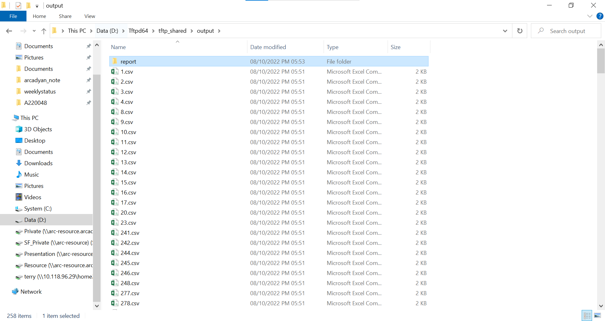
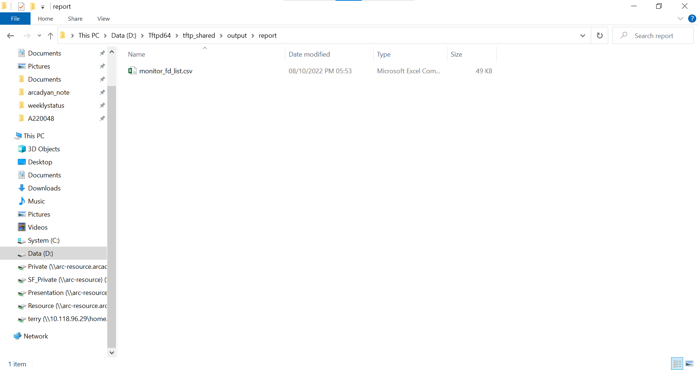
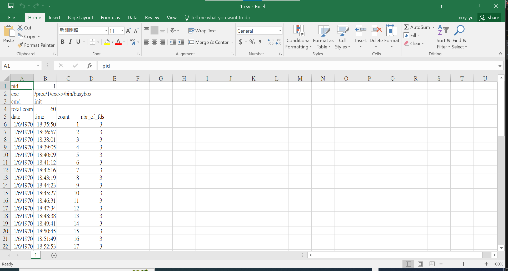
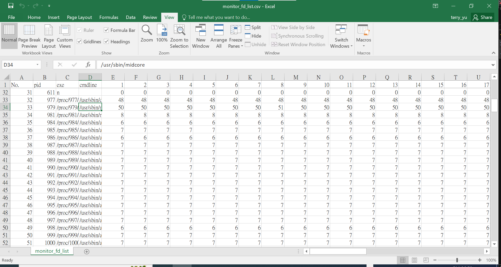

# process monitor


[toc]

## usage

Please download the [git repo](https://github.com/TUNGHUAYU/process_monitor)

```bash
$ git clone https://github.com/TUNGHUAYU/process_monitor
$ cd process_monitor

# monitor 1 hour and sampling each 1 min ( default )
$ busybox sh do_monitor.sh 

# monitor 1 hour and sampling each 2 mins
$ busybox sh do_monitor.sh --time 1 --period 2 
```


usage:

```bash
usage do_monitor.sh [-t, --time <time>][-p, --period <period>][-h, --help]

<time>    : total time for monitoring process state   (uint:hr) (default: 1hr)
<period>  : sampling rate                             (uint:min)(default: 1min)
```


## Layout

Repo first level Layout:

```bash
process_monitor/
├── README.md		# this document
├── do_analyze.sh	# analyze process status during monitor time
├── do_monitor.sh	# monitor process status (main process)
└── output/			# output storage
```


Output folder Layout:

```bash
output/			
├── <pid>.csv	# store <pid> stage process status during monitor time
├── <pid>.csv	# store <pid> stage process status during monitor time
├── <pid>.csv	# store <pid> stage process status during monitor time
├── ...(ignore)...	
├── log.txt		# store the progress of the monitor process
├── error.txt	# store the error message during monitor time
└── report/		# outcome after "do_analyze" process
```


Report folder Layout:

```bash
report/
└── monitor_fd_list.csv 	# list all process fd status during monitor time 
```


## Snapshots


Table 1. The specification of device.

| Title        | Content            |
| ------------ | ------------------ |
| product      | spark              |
| product code | VRV9517ZWAX34-A-SP |




Figure 1. Snapshot of the folder "output/" content




Figure 2. Snapshot of the folder "output/report" content




Figure 3. Show the content of the file that records the number of fds during monitor time.




Figure 4. Show the content of the report file that record the number of fds in each process during monitor time.
