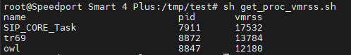
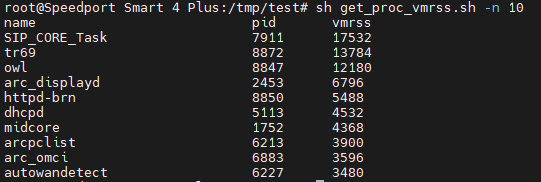

# process monitor


[toc]


## Download

Please download the [git repo](https://github.com/TUNGHUAYU/process_monitor)

```bash
$ git clone https://github.com/TUNGHUAYU/process_monitor
```


## monitor fd (file descriptor)

### Usage

usage:

```bash
# do_monitor.sh usage 
usage do_monitor.sh [-t, --time <time>][-p, --period <period>][-h, --help]

<time>    : total time for monitoring process state   (uint:hr) (default: 1hr)
<period>  : sampling rate                             (uint:min)(default: 1min)

# monitor 1 hour and sampling each 1 min ( default )
$ busybox sh do_monitor.sh 

# monitor 1 hour and sampling each 2 mins
$ busybox sh do_monitor.sh --time 1 --period 2 
```


### Output Layout

Output folder Layout:

```bash
output/			
├── <pid>.csv	# store <pid> stage process status during monitor time
├── <pid>.csv	# store <pid> stage process status during monitor time
├── <pid>.csv	# store <pid> stage process status during monitor time
├── ...(ignore)...	
├── log.txt		# store the progress of the monitor process
├── error.txt	# store the error message during monitor time
└── report/		# outcome after "do_analyze" process
	└── monitor_fd_list.csv 	# list all process fd status during monitor time 
```


### Snapshots


Table 1. The specification of device.

| Title        | Content            |
| ------------ | ------------------ |
| product      | spark              |
| product code | VRV9517ZWAX34-A-SP |


Figure 1. Snapshot of the folder "output/" content


Figure 2. Snapshot of the folder "output/report" content


Figure 3. Show the content of the file that records the number of fds during monitor time.


Figure 4. Show the content of the report file that record the number of fds in each process during monitor time.


## monitor memory (vmRSS)

### Usage


usage:

```bash
# get_proc_vmrss.sh usage 
usage: get_proc_vmrss.sh [-n, --nth_proc <n-th process>] [-h, --help]
<n-th process>: the first n biggest process of memory occupied

e.g.
sh get_proc_vmrss.sh            # display first 3 biggest process of memory occupied
sh get_proc_vmrss.sh -n 10      # display first n=10 biggest process of memory occupied
```


### Snapshots



Figure 5. Snapshot of `sh get_proc_vmrss.sh`




Figure 5. Snapshot of `sh get_proc_vmrss.sh -n 10`
